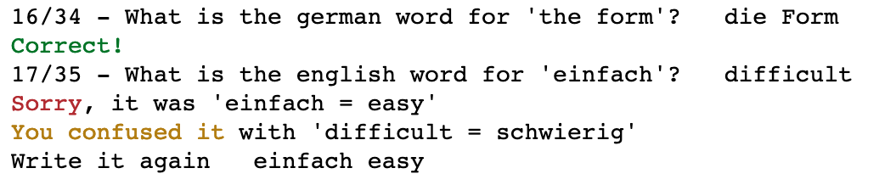
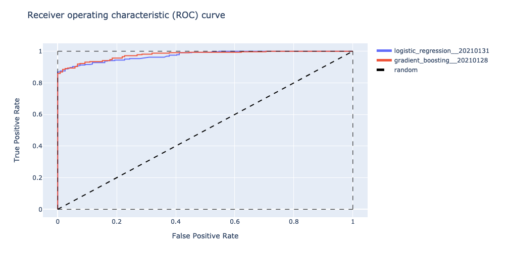
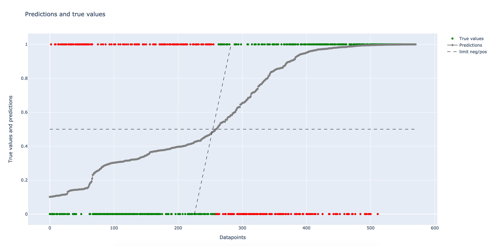
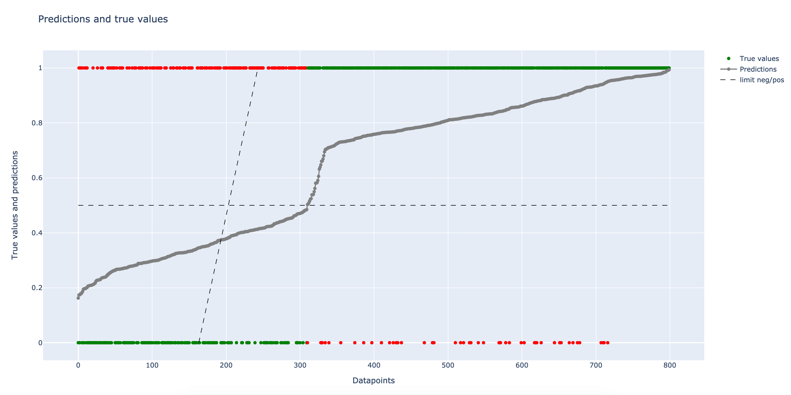
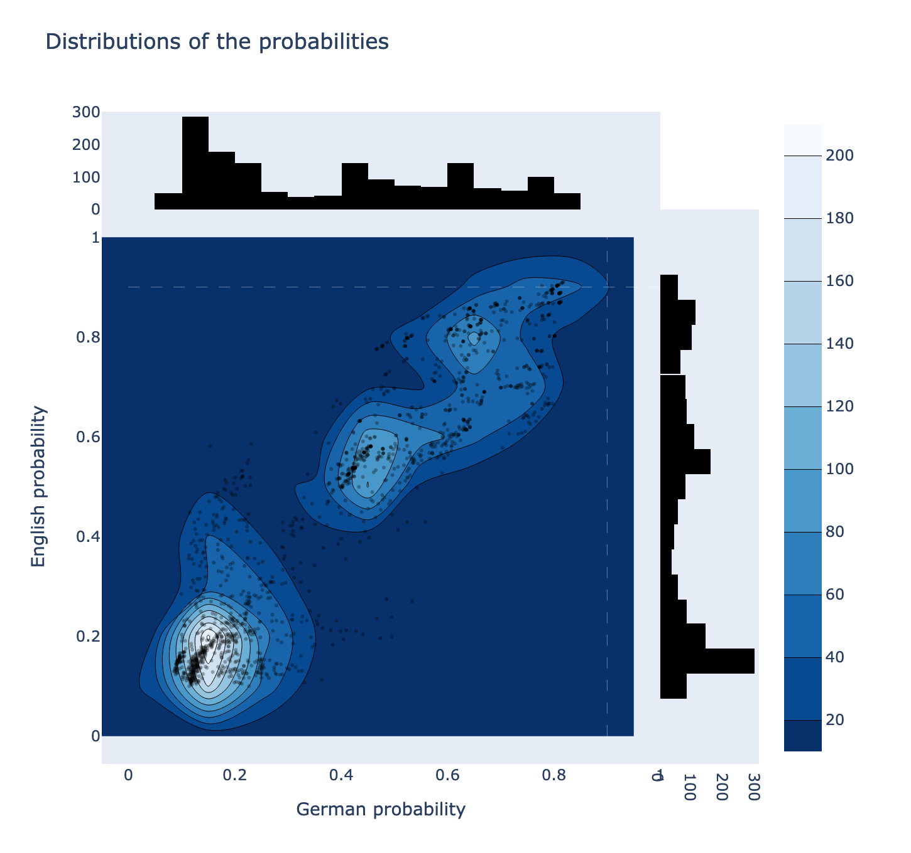
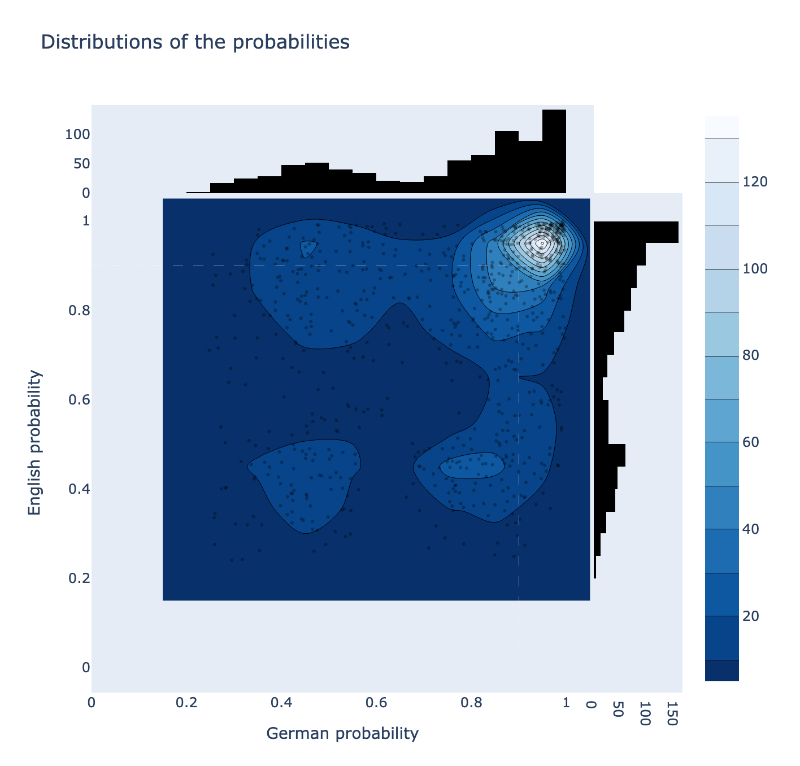

Vocabulary Learning
==============================

This project is dedicated to learn words in a new language (German in my case).

Process
------------

A dictionary of words is uploaded (for example, a list of A1 words) with their English and German translations.

During a learning session, the process is as follow:

* a word in English or German is proposed to the user, who has to answer with its translation
* the user enters his/her answer
* a message is prompted to the user
	* if the translation was correct, it congratulates you
	* if not, the correct word is prompted ; if you confused it with another word, it tells you ; a text box also opens to write the word again

All tries are recorded, with information like the input language, the time, or how many words were already tried during this session.

A model is then build before the next session to predict whether a word is already known by the user. These predictions are later used when choosing a word: a word with a high probability of being known has a lower chance of being asked than a word of lower probability.

Models
------------

2 models are currently implemented.

1. Logistic Regression
2. Gradient Boosting algorithm

A Luigi pipeline takes care of the creation process.

### Model performances

| Metric        | Logistic Regression     | Gradient Boosting     |
| :------------- | :----------: | :-----------: |
|  Precison | 0.929   | 0.970    |
| Recall   | 0.944 | 0.919 |
| F1-score   | 0.936 | 0.944 |
| Accuracy   | 0.907 | 0.920 |
| ROC AUC   | 0.875 | 0.921 |
| MAE   | 0.118 | 0.164 |

Visualization
------------

##### Prediction labels

This plot represents the predicted datapoints on the test dataset. On the x-axis are represented datapoints, sorted by predicted value (from 0 to 1) ; on the y-axis their values. In grey are the predicted value. True values are plotted on y=1 (if positive) and on y=0 (if negative), with 2 colors: in green if they were correctly predicted, on red if not. The diagonal dashed line represents the change between negative and positive values in the true values.

On the first graph, we observe a (too) smooth transition in the predicted values between positive and negative. No clear distinction is made, and we have lots of predicted values between 0.3 and 0.8. We also observe a bump around 0.2.

On the second graph, in this case, a clear distinction is made between negative and positive. However we can observe that the model is unbalanced: we predict more negative values than there really is.

#####  Distribution of the predictions before learning

These graphs represent the distributions of the predictions for English and German before a learning session. On the x-axis and top are represented the German predictions, and the y-axis and right are represented the English predictions.

On the first graph, we can see that we are before a session where the user has a lot of unknown words (possibly new words), and is in the process of learning the others.

Distributions are nearly symmetrical. Drawing the diagonal line would show us that the English predictions are slightly higher than German predictions, which is expected: it is easier for me to say the English translation of a German word, than the German translation of an English word.

On the second graph, we observe that most of the words are known: the distributions are concentrated on 1. Other words are in the process of being known.

Next steps
------------

- [ ] New model: Recurrent Neural Network, using binary {known_unknown} variables as training data

Project Organization
------------

    ├── LICENSE
    ├── README.md          <- The top-level README for developers using this project.
    │
    ├── data
    │   ├── external       <- Data from third party sources.
    │   ├── figures        <- Plots and other information.
    │   ├── interim        <- Intermediate data that has been transformed.
    │   ├── log            <- Logs using a default name: 'YYYYmmdd_HHMMSS_file_handler_name'
    │   ├── official       <- Personal dataset used for my learning.
    │   ├── processed      <- The final, canonical data sets for modeling.
    │   └── raw            <- The original, immutable data dump.
    │
    ├── docs               <- A default Sphinx project; see sphinx-doc.org for details
    │
    ├── models             <- Trained and serialized models, model predictions, or model summaries
    │
    ├── notebooks          <- Jupyter notebooks. 
    │
    ├── references         <- Data dictionaries, manuals, and all other explanatory materials.
    │
    ├── reports            <- Generated analysis as HTML, PDF, LaTeX, etc.
    │   └── figures        <- Generated graphics and figures to be used in reporting
    │
    ├── requirements.txt   <- The requirements file for reproducing the analysis environment, e.g.
    │                         generated with `pip freeze > requirements.txt`
    │
    ├── setup.py           <- makes project pip installable (pip install -e .) so src can be imported
    │
    ├── src                <- Source code for use in this project.
    │   ├── __init__.py    <- Makes src a Python module
    │   │
    │   ├── data           <- Scripts to download or generate data
    │   │
    │   ├── features       <- Scripts to turn raw data into features for modeling
    │   │
    │   ├── models         <- Scripts to train models and then use trained models to make predictions
    │   │
    │   ├── unit_tests     <- unit tests
    │   │
    │   ├── utils          <- utilities
    │   │
    │   └── visualization  <- Scripts to create exploratory and results oriented visualizations
    │
    └── tox.ini            <- tox file with settings for running tox; see tox.testrun.org

--------

<small>Project based on the <a target="_blank" href="https://drivendata.github.io/cookiecutter-data-science/">cookiecutter data science project template</a>. #cookiecutterdatascience</small>

